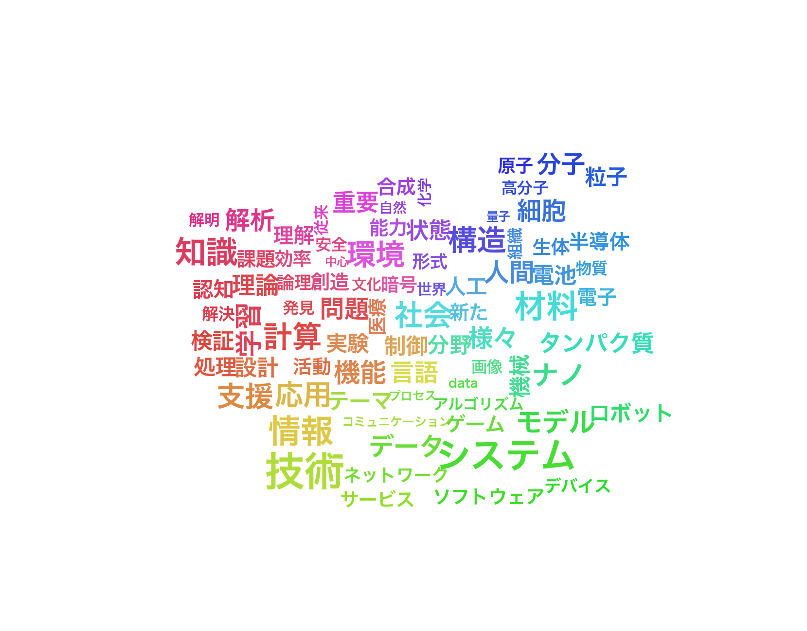

# Semantic Word Cloud

意味的に類似した単語を近くに配置するワードクラウド生成ツール

| 項目 | 内容 |
|------|------|
| 作成者 | 荻 多加之 |
| 作成支援 | Claude Code (Anthropic) |
| バージョン | 1.2 |
| 最終更新 | 2025-01-29 |



## 特徴

- **意味的配置**: OpenAI Embeddingsを使用し、類似した単語を近くに配置
- **日本語対応**: Janomeによる形態素解析で日本語テキストを処理
- **標準ストップワード**: 日本語・英語のストップワードを自動取得
- **キャッシュ機能**: 埋め込みベクトルをキャッシュしてAPI呼び出しを削減
- **異方性レイアウト**: 横長・縦長など任意のアスペクト比に対応

## インストール

```bash
git clone https://github.com/takayuki1997/semantic-wordcloud.git
cd semantic-wordcloud
python3 -m venv venv
source venv/bin/activate
pip install -r requirements.txt
```

## 使い方

### 基本

```bash
source venv/bin/activate
export OPENAI_API_KEY="your-api-key"
python semantic_wordcloud.py input.txt -o output.png
```

画像と同名のCSVファイル（単語リスト）およびSVGファイルも自動出力されます。

### オプション

| オプション | デフォルト | 説明 |
|-----------|-----------|------|
| `-o, --output` | semantic_wordcloud.png | 出力ファイル名 |
| `-n, --num-words` | 80 | 表示する単語数 |
| `--custom-words` | None | カスタム単語ファイル |
| `--export-words` | 自動 | 単語リストCSVの出力先（デフォルトは画像と同名） |
| `--cache-words` | 200 | キャッシュする単語数 |
| `--iterations` | 500 | レイアウト反復回数 |
| `--seed` | None | ランダムシード（再現性確保） |
| `--api-key` | 環境変数 | OpenAI APIキー |

### 例

```bash
# Excel ファイルから生成
python semantic_wordcloud.py research_data.xlsx -o wordcloud.png

# 単語数を増やして生成
python semantic_wordcloud.py input.txt -n 100 --iterations 800

# 再現可能な結果を得る
python semantic_wordcloud.py input.txt --seed 42

# カスタム単語を追加して生成
python semantic_wordcloud.py input.txt --custom-words custom_words.txt

# カスタム単語のみでワードクラウド生成
python semantic_wordcloud.py --custom-words custom_words.txt -o output.png
```

### カスタム単語

任意の単語を任意のサイズで追加できます。テキストから抽出した単語と混ぜて、PCA・配置を行います。

**ファイル形式**（タブ区切り: 単語 + 正規化値）:
```
# コメント行
機械学習	1.0
深層学習	0.8
ニューラルネットワーク	0.6
```

正規化値は 0.0〜1.0 の範囲で、文字サイズに対応:
- `1.0` = 最大サイズ（40pt）
- `0.5` = 中間サイズ（約32pt）
- `0.0` = 最小サイズ（12pt）

サンプル: [custom_words_example.txt](custom_words_example.txt)

### 単語リストのエクスポート

画像と同名のCSVファイルが自動出力されます（例: `WordCloud_20251228.png` → `WordCloud_20251228.csv`）。

出力先を指定したい場合:
```bash
python semantic_wordcloud.py input.txt --export-words words.csv
```

CSVには単語、出現回数、正規化値、フォントサイズ、カスタム有無、頻度計算値、差分が含まれます。
また、CSVの末尾にはカスタムストップワード（除外単語）が `exclude` 付きで記載されます。

## 対応フォーマット

### 入力

- テキストファイル (.txt)
- Excel ファイル (.xlsx, .xls)

### 出力

- PNG画像（ラスター形式）
- SVG画像（ベクター形式、フォントはパスに変換済み）
- CSVファイル（単語リスト）

SVGはPowerPoint/Wordに直接挿入でき、拡大縮小しても劣化しません。

## カスタマイズ

### ストップワード

`stopwords.txt` を編集して除外する単語を追加できます：

```
# コメント行
研究
可能
手法
```

## アルゴリズム

詳細は [docs/algorithm.md](docs/algorithm.md)（[PDF版](docs/algorithm.pdf)）を参照してください。

### 概要

1. **形態素解析**: Janomeで名詞を抽出
2. **埋め込み取得**: OpenAI text-embedding-3-small (1536次元)
3. **Force-directed Layout**: 高次元コサイン距離を制約として2D配置を最適化
4. **色付け**: PCAによる2D射影の角度から色相を決定

## 必要要件

- Python 3.10+
- OpenAI API キー

## ライセンス

MIT License

## 関連リンク

- [OpenAI Embeddings](https://platform.openai.com/docs/guides/embeddings)
- [Janome](https://mocobeta.github.io/janome/)
